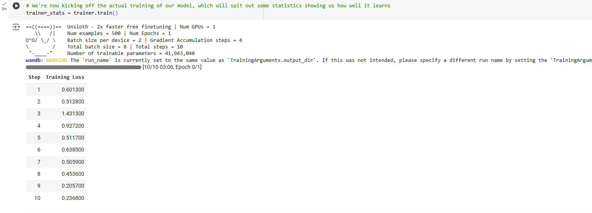
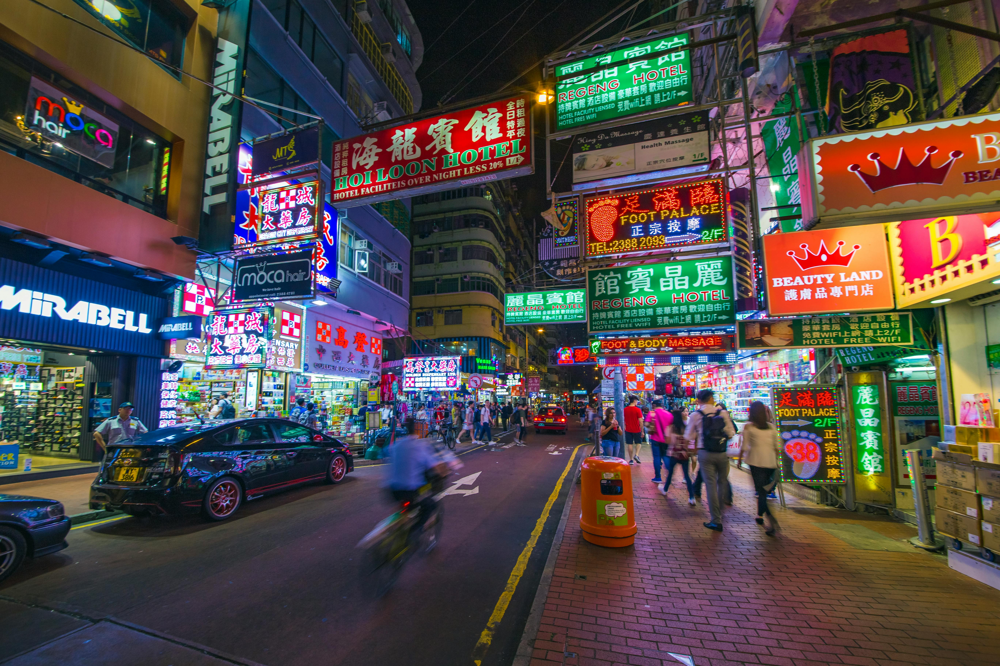
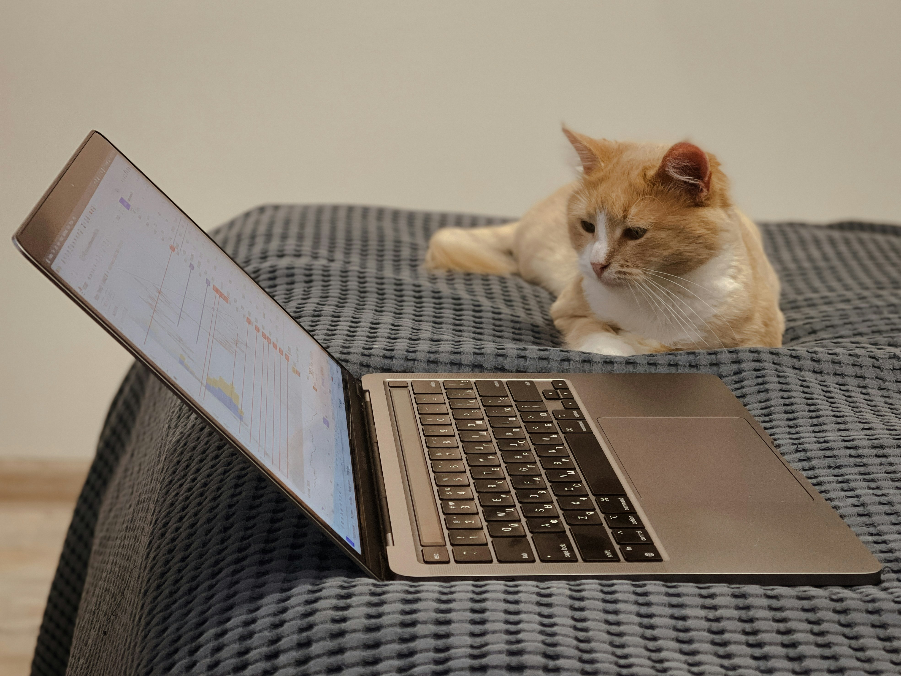

# Image captioning using pre-trained Yolo v8m with LLAMA 3 - 8b

## Image Analysis : 
Started by getting objects information from 1000 image  from flicker captioned dataset


Example of information:
<!-- ```{
        {'objects_info': [{'name': 'bench_1',
    'bbox': [2484, 1984, 3652, 2550],
    'score': 0.8641608357429504,
    'color': 'midnightblue'}],
    'relationships': '',
    'setting': 'The image was taken during the night. It appears to be in a suburban area. ',
    'objects_count': {'bench': 1}} 
}; -->

Colors of objects where extracted by calculating **histogram** of each object image and get top 2  rgb values then search for the least distance from defined values withing webcolors package to get the name of the color 

## Fine tuning LLAMA 3  :
I used unsloth repo  to be able to use llama 3 with qunatization to make training faster  and finetuned using Lora technique

link of the repo : 

https://github.com/unslothai/unsloth


## Generating data :

Preprocessing.ipynb a notebook runed on Kaggle that utilize flicker dataset

 Generated 500 examples from flicker dataset  with what I could think of as useful information to the model.

getSpatialRelations.py contains the logic to apply on detected objects in a given image to get some context about relations like :
- A cat is on a left side of  a dog  
- A black dog is right to a white dog.


After finetuning I got these results 



Prompt for teaching LLAMA 3 -8B :
prompt :
```json
    {

Below is an instruction that describes a task, paired with an input that provides further context. Write a response that appropriately completes the request.

### Instruction:
{}

### Input:
{}

### Response:
{}

    }


## Examples of generated data :


        {
            #Example 1
        'instruction': 'Generate a detailed caption based on the given information about the image with hypothesizing any missing information.',
        'output': 'A blonde fisherman standing in the water prepares his hook .'},

        {'input': 'This image contains the following objects: bird_1 (confidence: 0.94, color: whitesmoke). The setting of the image is: The image maybe was taken during the night. It appears to be in a suburban area. ',

        'instruction': 'Generate a detailed caption based on the given information about the image with hypothesizing any missing information.',

        'output': 'A large white bird flies out of the water .'},

        #Example 2
        {'input': 'This image contains the following objects: dog_1 (confidence: 0.87, color: white), person_1 (confidence: 0.35, color: white). Relationships between objects: d o g_1   i s   t o   t h e   l e f t   o f   t h e   p e r s o n _ 1 .. The setting of the image is: The image maybe was taken during the daytime. It appears to be in a suburban area. ',
        'instruction': 'Generate a detailed caption based on the given information about the image with hypothesizing any missing information.',
        'output': 'A black dog plays with another animal .'}

```

## Handling edge cases : 

Using colorsExtractor.py we can extract most 3 colors in an image by using k-means algorithm and feed it to the LLM to generate a context even if no objects detected.

## Future work :

I was going to use **CLIP** model to generate embedding of image and calculate the distance between the generated candidates of captions from LLAMA model to choose best caption for the image , but had no time .


# Output on test images 


prompt : 
Generate a detailed caption based on the given information about the image.

input : This image with shape (3456, 5184) contains bench,details of objects: midnightblue bench_1 in position [3068.0, 2267.0] and dominant green color.


**Generated caption** : 

Response: A group of friends is sitting on a bench in a park. The park is surrounded by tall trees and has a pond in the center. The weather is sunny and the sky is blue. The friends are having a good time and are enjoying the beautiful scenery





prompt : 

Looks very large  prompt but result is somewhat good.

This image with shape (3648, 5472) containscar person motorcycle,details of objects: black car_1 in position [1216.5, 2563.5]  ), black car_2 in position [197.0, 2935.5]  ), darkslategrey person_1 in position [3896.0, 2511.5]  ), black person_2 in position [4161.5, 2560.5]  ), black car_3 in position [3011.5, 2295.0]  ), darkslategrey motorcycle_1 in position [2200.0, 2939.5]  ), darkblue person_3 in position [3467.5, 2343.5]  ), black person_4 in position [3607.0, 2402.5]  ), black person_5 in position [3719.5, 2489.0]  ), black person_6 in position [3344.5, 2363.5]  ), saddlebrown person_7 in position [660.5, 2338.0]  ), darkslategrey person_8 in position [2287.0, 2642.5]  ), maroon person_9 in position [2658.0, 2314.5]  ), saddlebrown person_10 in position [1211.5, 2220.0]  ), darkslategrey person_11 in position [2836.0, 2315.0]  ), saddlebrown person_12 in position [2279.5, 2510.0]  ), darkslategrey person_13 in position [2576.5, 2309.0]  ), darkslategrey person_14 in position [3236.5, 2328.5]  ). Relationships between objects: car_1 is to the right of the car_2. car_1 is to the left of the person_1. car_1 is to the left of the person_2. car_1 is to the left of the car_3. car_1 is to the left of the motorcycle_1. car_1 is to the left of the person_3. car_1 is to the left of the person_4. car_1 is to the left of the person_5. car_1 is to the left of the person_6. car_1 is to the right of the person_7. car_1 is to the left of the person_8. car_1 is to the left of the person_9. car_1 is to the right of the person_10. car_1 is to the left of the person_11. car_1 is to the left of the person_12. car_1 is to the left of the person_13. car_1 is to the left of the person_14. car_2 is to the left of the person_1. car_2 is to the left of the person_2. car_2 is to the left of the car_3. car_2 is to the left of the motorcycle_1. car_2 is to the left of the person_3. car_2 is to the left of the person_4. car_2 is to the left of the person_5. car_2 is to the left of the person_6. car_2 is to the left of the person_7. car_2 is to the left of the person_8. car_2 is to the left of the person_9. car_2 is to the left of the person_10. car_2 is to the left of the person_11. car_2 is to the left of the person_12. car_2 is to the left of the person_13. car_2 is to the left of the person_14. person_1 is to the left of the person_2. person_1 is to the right of the car_3. person_1 is to the right of the motorcycle_1. person_1 is to the right of the person_3. person_1 is to the right of the person_4. person_1 is to the right of the person_5. person_1 is to the right of the person_6. person_1 is to the right of the person_7. person_1 is to the right of the person_8. person_1 is to the right of the person_9. person_1 is to the right of the person_10. person_1 is to the right of the person_11. person_1 is to the right of the person_12. person_1 is to the right of the person_13. person_1 is to the right of the person_14. person_2 is to the right of the car_3. person_2 is to the right of the motorcycle_1. person_2 is to the right of the person_3. person_2 is to the right of the person_4. person_2 is to the right of the person_5. person_2 is to the right of the person_6. person_2 is to the right of the person_7. person_2 is to the right of the person_8. person_2 is to the right of the person_9. person_2 is to the right of the person_10. person_2 is to the right of the person_11. person_2 is to the right of the person_12. person_2 is to the right of the person_13. person_2 is to the right of the person_14. car_3 is to the right of the motorcycle_1. car_3 is to the left of the person_3. car_3 is to the left of the person_4. car_3 is to the left of the person_5. car_3 is to the left of the person_6. car_3 is to the right of the person_7. car_3 is to the right of the person_8. car_3 is to the right of the person_9. car_3 is to the right of the person_10. car_3 is to the right of the person_11. car_3 is to the right of the person_12. car_3 is to the right of the person_13. car_3 is to the left of the person_14. motorcycle_1 is to the left of the person_3. motorcycle_1 is to the left of the person_4. motorcycle_1 is to the left of the person_5. motorcycle_1 is to the left of the person_6. motorcycle_1 is to the right of the person_7. motorcycle_1 is to the left of the person_8. motorcycle_1 is to the left of the person_9. motorcycle_1 is to the right of the person_10. motorcycle_1 is to the left of the person_11. motorcycle_1 is to the left of the person_12. motorcycle_1 is to the left of the person_13. motorcycle_1 is to the left of the person_14. person_3 is to the left of the person_4. person_3 is to the left of the person_5. person_3 is to the right of the person_6. person_3 is to the right of the person_7. person_3 is to the right of the person_8. person_3 is to the right of the person_9. person_3 is to the right of the person_10. person_3 is to the right of the person_11. person_3 is to the right of the person_12. person_3 is to the right of the person_13. person_3 is to the right of the person_14. person_4 is to the left of the person_5. person_4 is to the right of the person_6. person_4 is to the right of the person_7. person_4 is to the right of the person_8. person_4 is to the right of the person_9. person_4 is to the right of the person_10. person_4 is to the right of the person_11. person_4 is to the right of the person_12. person_4 is to the right of the person_13. person_4 is to the right of the person_14. person_5 is to the right of the person_6. person_5 is to the right of the person_7. person_5 is to the right of the person_8. person_5 is to the right of the person_9. person_5 is to the right of the person_10. person_5 is to the right of the person_11. person_5 is to the right of the person_12. person_5 is to the right of the person_13. person_5 is to the right of the person_14. person_6 is to the right of the person_7. person_6 is to the right of the person_8. person_6 is to the right of the person_9. person_6 is to the right of the person_10. person_6 is to the right of the person_11. person_6 is to the right of the person_12. person_6 is to the right of the person_13. person_6 is to the right of the person_14. person_7 is to the left of the person_8. person_7 is to the left of the person_9. person_7 is to the left of the person_10. person_7 is to the left of the person_11. person_7 is to the left of the person_12. person_7 is to the left of the person_13. person_7 is to the left of the person_14. person_8 is to the left of the person_9. person_8 is to the right of the person_10. person_8 is to the left of the person_11. person_8 is to the right of the person_12. person_8 is to the left of the person_13. person_8 is to the left of the person_14. person_9 is to the right of the person_10. person_9 is to the left of the person_11. person_9 is to the right of the person_12. person_9 is to the right of the person_13. person_9 is to the left of the person_14. person_10 is to the left of the person_11. person_10 is to the left of the person_12. person_10 is to the left of the person_13. person_10 is to the left of the person_14. person_11 is to the right of the person_12. person_11 is to the right of the person_13. person_11 is to the left of the person_14. person_12 is to the left of the person_13. person_12 is to the left of the person_14. person_13 is to the left of the person_14.. settings: The image maybe was taken during the night. It appears to be in a suburban area.


caption : 

A group of people are riding a motorcycle on a road.





prompt : 


caption : 


This with no temprrature : 

A young man sits at his desk, looking at a laptop computer. He is wearing a black shirt and jeans. In the background, a cat is sitting on a bed. The room is well lit and the walls are painted a light color. The desk is made of wood and has a large window

**when setting temprature  = 0.2   , the output become accurate :**

A cat is sitting on a bed. A laptop is on the bed. The cat is looking at the laptop. The cat is looking at the laptop. The cat is looking at the laptop


#### The output generated by running finetuned model on prompts for images : 

Colab Link : https://colab.research.google.com/drive/1IXv82ngKhQ9aSuaFe0Ve83RfJllsPEsX?usp=sharing